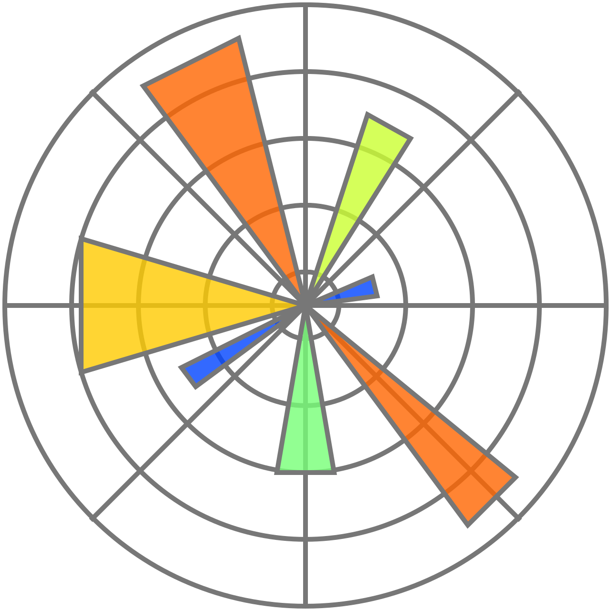
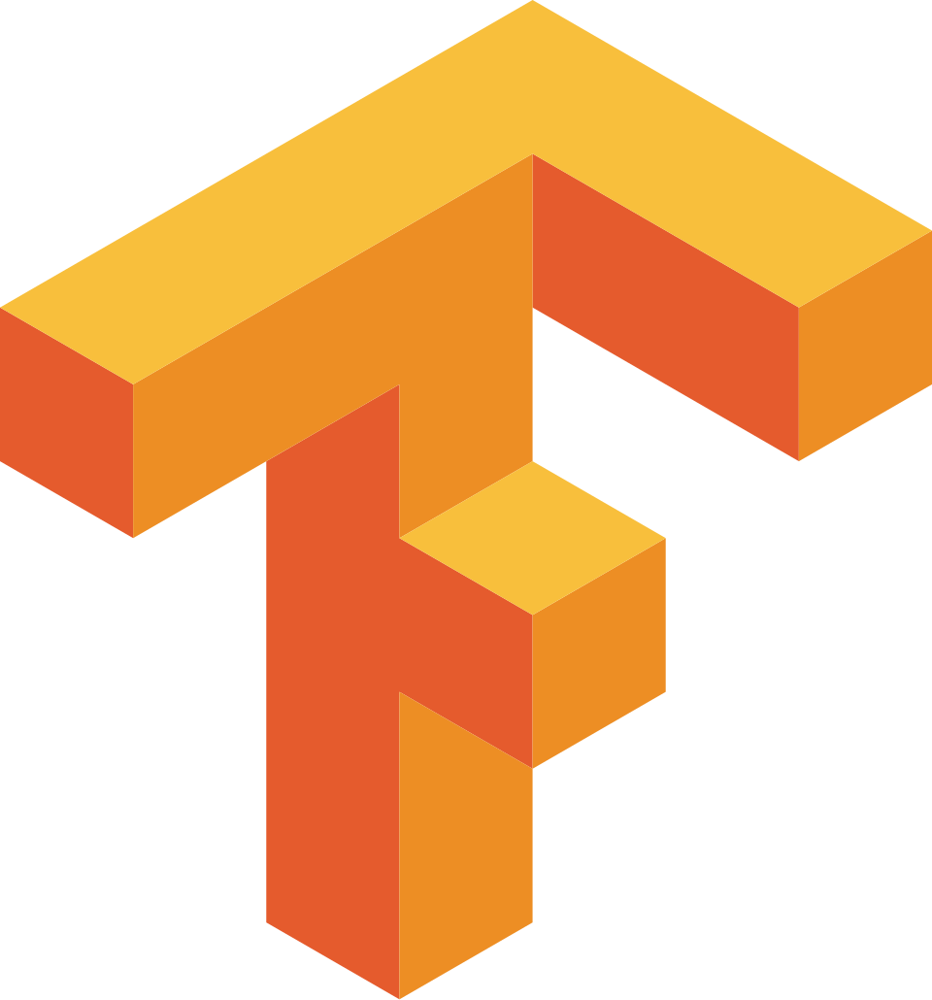
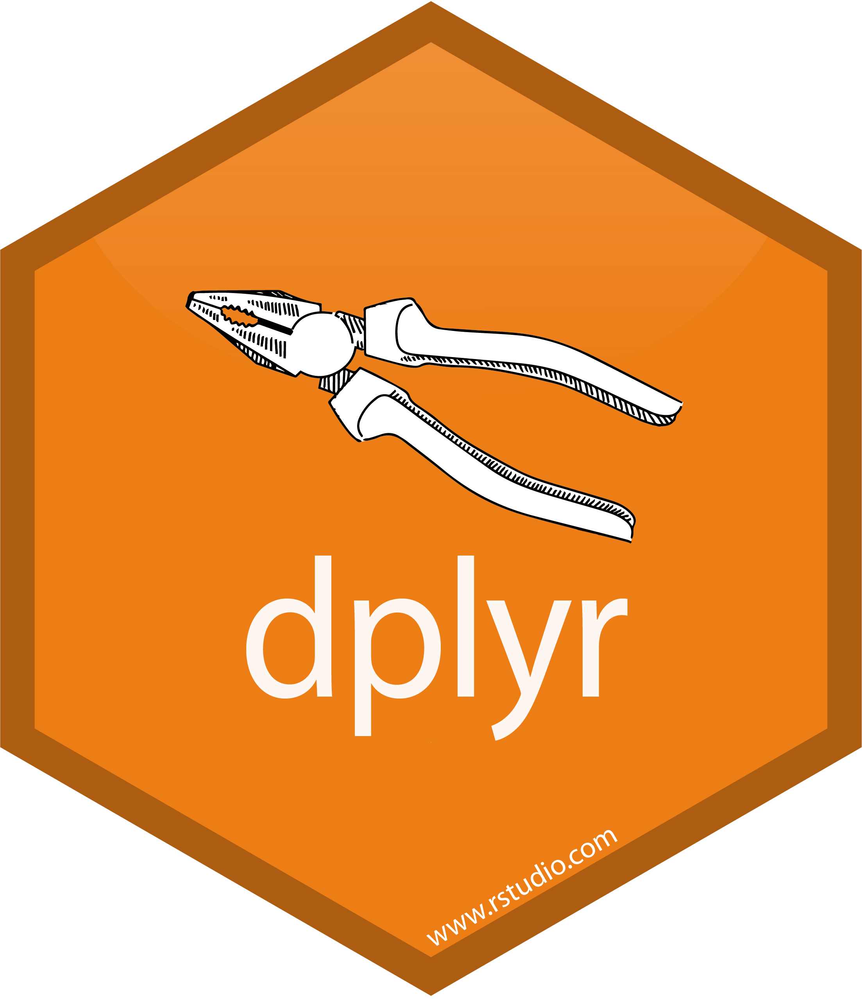
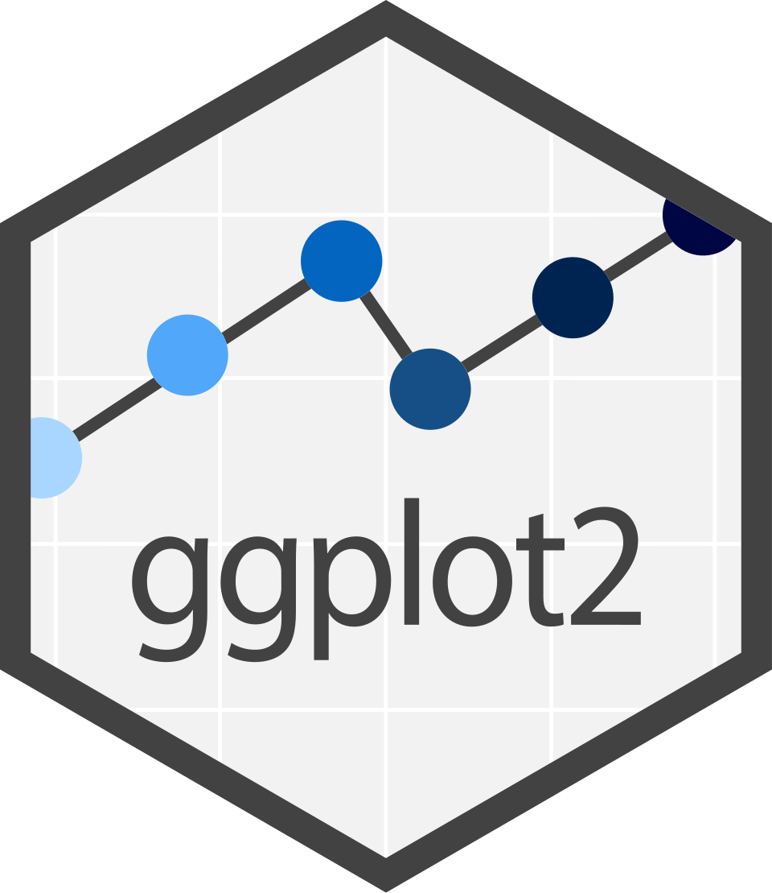
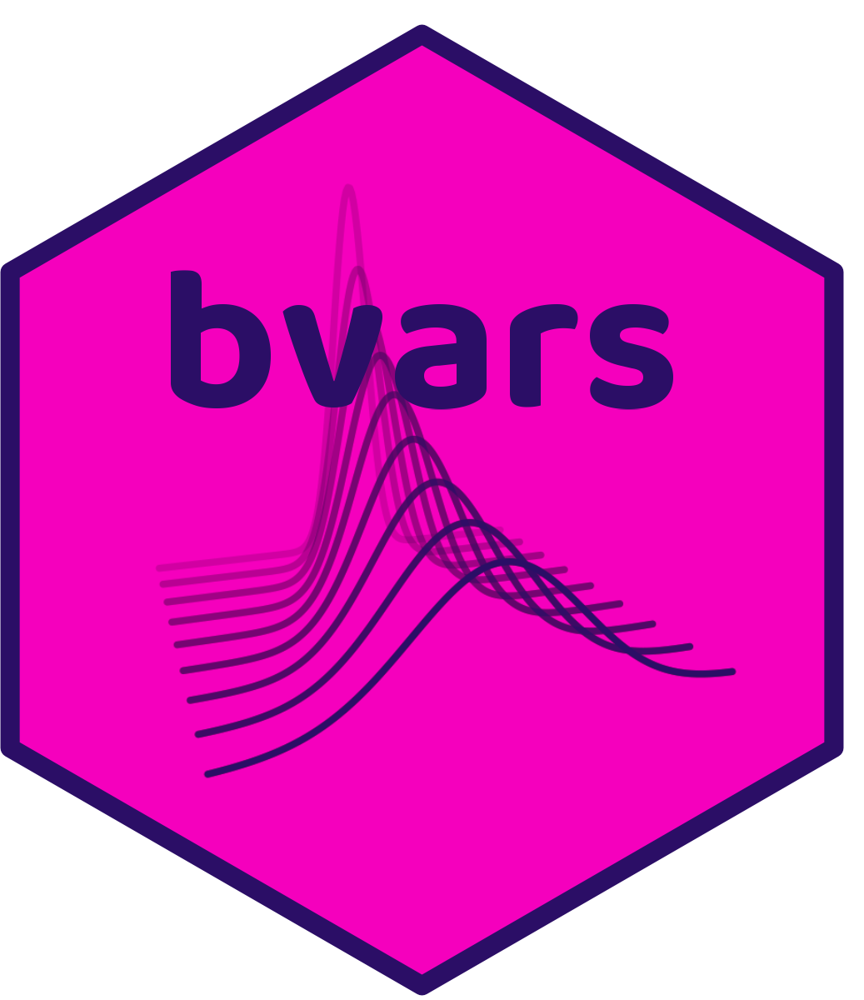
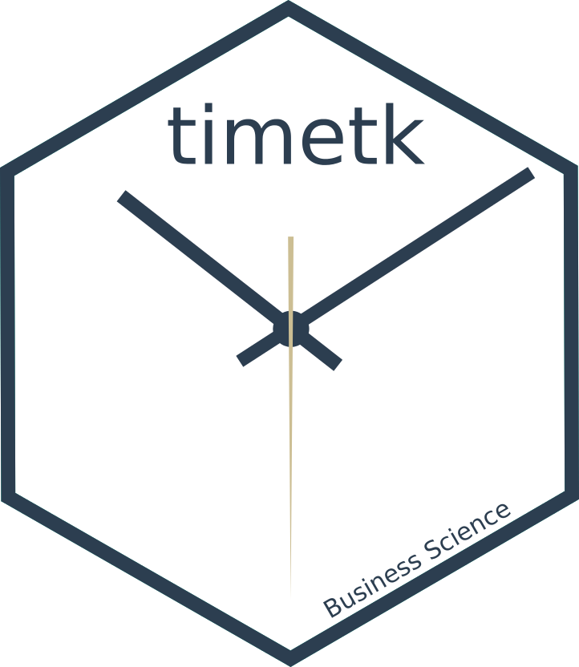
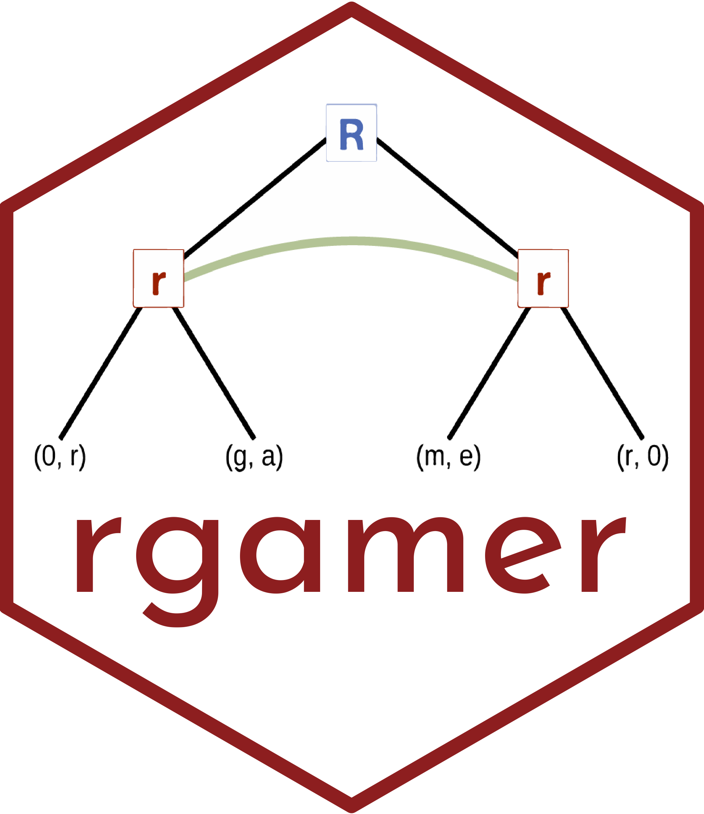

<!-- Sobre Mim --->
::: {.text-center .py-4 .pb-2}
[**Sobre Mim**]{style='font-size: 25px;'}

Sou economista especializado em econometria e métodos quantitativos, com mais de 5 anos de experiência em multinacional. Conecto o rigor da inferência causal à agilidade do Business Intelligence (BI) para responder não apenas o que aconteceu, mas o "porquê". Meu foco é isolar o real impacto de ações estratégicas, transformando dados complexos em decisões de negócio baseadas em causa e efeito, e não em meras correlações.
:::

<!-- Formações --->
::: {.column-body .py-4}
::: {.grid}

::: {.g-col-12 .g-col-md-6}
[[**Mestrado Profissional**]{style='color: var(--bs-gray-600); font-size: 20px;'}   [**Economia**]{style='font-size: 25px;'}]{style='line-height: 0.5;'}   Atuação focada em finanças e análise de **séries temporais**, com ênfase em técnicas de forecasting.
:::

::: {.g-col-12 .g-col-md-6}
[[**Bacharelado**]{style='color: var(--bs-gray-600); font-size: 20px;'}   [**Ciências Econômicas**]{style='font-size: 25px;'}]{style='line-height: 0.5;'}   Forte atuação em **métodos quantitativos**, com foco na avaliação de impacto ex-ante de políticas públicas.
:::

:::
:::

<!-- Experiência --->
::: {.column-body .py-2}
::: {.grid}

::: {.g-col-12 .g-col-md-4}
[[**Experiência Profissional**]{style='color: var(--bs-gray-600); font-size: 20px;'}   [**+5 Anos**]{style='font-size: 60px;color: var(--bs-primary);'}]{style='line-height: 1.0;'}   Mais de cinco anos de experiência, combinando vivência acadêmica e atuação em multinacional.
:::

<!-- Frameworks --->
::: {.g-col-12 .g-col-md-8}
[**Frameworks Utilizados**]{style='color: var(--bs-gray-600); font-size: 20px;'}   

::: {.grid .row-gap-1 .col-gap-0}

<!-- Python -->
::: {.g-col-2}
{style="height: 50px; object-fit: contain;"}
:::

::: {.g-col-2}
{style="height: 50px; object-fit: contain;"}
:::

::: {.g-col-2}
{style="height: 50px; object-fit: contain;"}
:::

::: {.g-col-2}
{style="height: 50px; object-fit: contain;"}
:::

::: {.g-col-2}
{style="height: 50px; object-fit: contain;"}
:::

::: {.g-col-2}
{style="height: 50px; object-fit: contain;"}
:::

<!-- R -->
::: {.g-col-2}
{style="height: 50px; object-fit: contain;"}
:::

::: {.g-col-2}
{style="height: 50px; object-fit: contain;"}
:::

::: {.g-col-2}
{style="height: 50px; object-fit: contain;"}
:::

::: {.g-col-2}
{style="height: 50px; object-fit: contain;"}
:::

::: {.g-col-2}
{style="height: 50px; object-fit: contain;"}
:::

::: {.g-col-2}
{style="height: 50px; object-fit: contain;"}
:::

:::

:::
:::