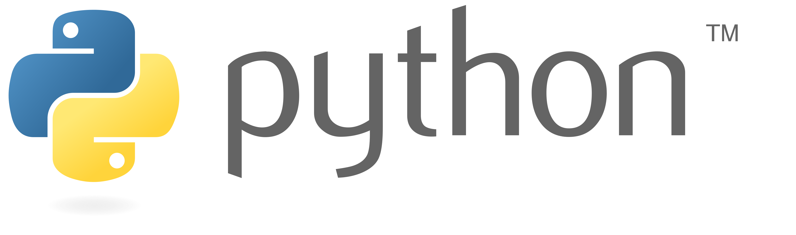

<!-- Introdução --->
::: {.text-center}
Atuando na aplicação de inferência causal para **ir além das relações superficiais** e responder o que realmente move os resultados de um negócio. Com foco em não é apenas descrever o passado, mas isolar o **verdadeiro impacto** — respondendo a perguntas críticas com seu efeito real.

{style="height: 340px; object-fit: contain;"}

<i class="bi bi-arrow-down"></i>
:::

<!-- Walasse Tomaz --->
::: {.column-screen .bg-light .py-2 .pb-4}
::: {.column-body}
### Walasse Tomaz   [Econometrista e Analista de Dados]{style='color: var(--bs-gray-600); font-size: 20px;'}
O verdadeiro desafio no mercado atual não é acumular dados, mas transformá-los em uma direção segura, superando relatórios superficiais que apenas ilustram o passado ou sugerem falsas relações. A resposta para essa dor está na **união entre o Business Intelligence e a Econometria**, mapeando as reais relações de causa e efeito para eliminar o "achismo" e guiar as decisões com base no real impacto.

<a class="btn btn-primary rounded-1" href="about.qmd" role="button">Sobre Mim</a>
<a class="btn btn-outline-secondary rounded-1 ms-2" href="./src/documents/curriculo-walasse-mickael-frutuoso-tomaz.pdf" download="curriculo-walasse-mickael-frutuoso-tomaz.pdf" role="button"><i class="bi bi-download me-2"></i>Download CV</a>
:::
:::

<!-- O que você encotrará --->
::: {.text-center .py-4 .pb-2}
[**O que você encotrará**]{style='font-size: 25px;'}

Espaço de projetos focado em transformar dados complexos em decisões estratégicas e automações. Minha atuação une ciência de dados, modelagem econômica e desenvolvimento técnico. Navegue pelos cards abaixo para **explorar meus trabalhos práticos**.
:::

::: {.grid .row-gap-2 .py-2}

::: {.g-col-3 .border .rounded .p-3 .bg-primary}
<i class="bi bi-exclude"></i> **Econometria**   [Modelagem estatística e inferência causal para tomada de decisão.]{style='font-size: 14px;'}   <a href="" style='font-size: 14px; color: var(--bs-light);'>**Ver Projetos**</a>
:::

::: {.g-col-3 .border .rounded .p-3 .bg-light}
<i class="bi bi-front"></i> **Otimização**   [Modelos matemáticos e algoritmos para alocação de recursos.]{style='font-size: 14px;'}   <a href="" style='font-size: 14px; color: var(--bs-primary);'>**Ver Projetos**</a>
:::

::: {.g-col-3 .border .rounded .p-3 .bg-primary}
<i class="bi bi-grid-1x2-fill"></i> **Analytics**   [Dashboards e análise visual de dados para gerar insights.]{style='font-size: 14px;'}   <a href="" style='font-size: 14px; color: var(--bs-light);'>**Ver Projetos**</a>
:::

::: {.g-col-3 .border .rounded .p-3 .bg-light}
<i class="bi bi-database-fill"></i> **Engenharia**   [Pipelines para tratamento de grandes volumes de dados.]{style='font-size: 14px;'}   <a href="" style='font-size: 14px; color: var(--bs-primary);'>**Ver Projetos**</a>
:::

::: {.g-col-3 .border .rounded .p-3 .bg-light}
<i class="bi bi-flask-fill"></i> **Teste A/B**   [Experimentação e validação de hipóteses de produto.]{style='font-size: 14px;'}   <a href="" style='font-size: 14px; color: var(--bs-primary);'>**Ver Projetos**</a>
:::

::: {.g-col-3 .border .rounded .p-3 .bg-secondary}
<i class="bi bi-terminal-plus"></i> **Programação**   [Desenvolvimento de scripts e ferramentas em código limpo.]{style='font-size: 14px;'}   <a href="" style='font-size: 14px; color: var(--bs-light);'>**Ver Projetos**</a>
:::

::: {.g-col-3 .border .rounded .p-3 .bg-light}
<i class="bi bi-currency-exchange"></i> **Finanças**   [Modelagem quantitativa, gestão de risco e análise de ativos.]{style='font-size: 14px;'}   <a href="" style='font-size: 14px; color: var(--bs-primary);'>**Ver Projetos**</a>
:::

::: {.g-col-3 .border .rounded .p-3 .bg-secondary}
<i class="bi bi-globe-americas-fill"></i> **Macroeconomia**   [Análise de cenários econômicos globais e séries temporais.]{style='font-size: 14px;'}   <a href="" style='font-size: 14px; color: var(--bs-light);'>**Ver Projetos**</a>
:::

:::
::: {.text-center .py-4 .pb-2}
Acesse meu repositório completo de projetos e explore os códigos, bases de dados e relatórios técnicos de cada solução desenvolvida.

<a class="btn btn-primary rounded-1" href="blog.qmd" role="button">Ver Portfólio Completo</a>

:::

<!-- Algumas tecnologias utilizadas --->
::: {.column-screen .bg-light}
::: {.column-body .text-center .py-4 .pb-2}
[**Algumas das tecnologias utilizadas**]{style='font-size: 25px;'}

::: {.grid}

::: {.g-col-2}
{style="height: 60px; object-fit: contain;"}
:::

::: {.g-col-2}
{style="height: 60px; object-fit: contain;"}
:::

::: {.g-col-2}
{style="height: 60px; object-fit: contain;"}
:::

::: {.g-col-2}
{style="height: 60px; object-fit: contain;"}
:::

::: {.g-col-2}
{style="height: 60px; object-fit: contain;"}
:::

::: {.g-col-2}
{style="height: 60px; object-fit: contain;"}
:::

:::

:::

:::